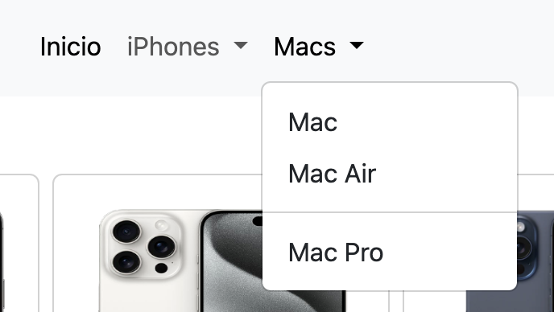
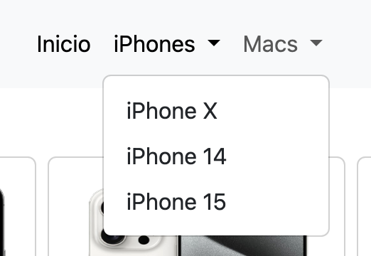
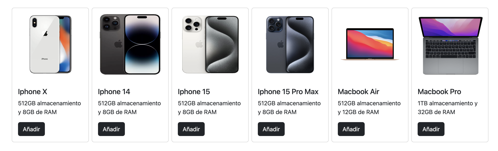
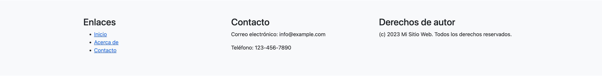

# Examen Bootstrap

## Introducción
Este examen tiene como objetivo evaluar tus conocimientos en el uso de la tecnología Bootstrap. Deberás crear una página web que contenga un navegador, cartas y un pie de página.

## Requisitos
1. **Navegador**: Debe incluir enlaces de navegación y estar estilizado con Bootstrap.

2. **Cartas**: Deben contener imágenes y texto, y estar organizadas en una cuadrícula responsiva (6 columnas para pantalla grande, 3 columnas para pantalla mediana y 1 columna para móvil).

3. **Pie de página**: Debe incluir información de contacto y enlaces a redes sociales, estilizado con Bootstrap.

## Instrucciones
1. Crea un nuevo proyecto y añade el archivo `index.html`.
2. Incluye el CDN de Bootstrap en el `<head>` de tu documento HTML.
3. Implementa el navegador utilizando componentes de Bootstrap.
4. Crea una sección de cartas utilizando el componente de cartas de Bootstrap.
5. Añade un pie de página estilizado con Bootstrap.

## Recursos útiles
- [Documentación de Bootstrap](https://getbootstrap.com/docs/5.1/getting-started/introduction/)
- [Guía de GitHub](https://guides.github.com/)

## Evaluación
Serás evaluado en base a:
- Correcta implementación de los componentes de Bootstrap.
- Responsividad y diseño de la página.
- Limpieza y organización del código.

¡Buena suerte!
